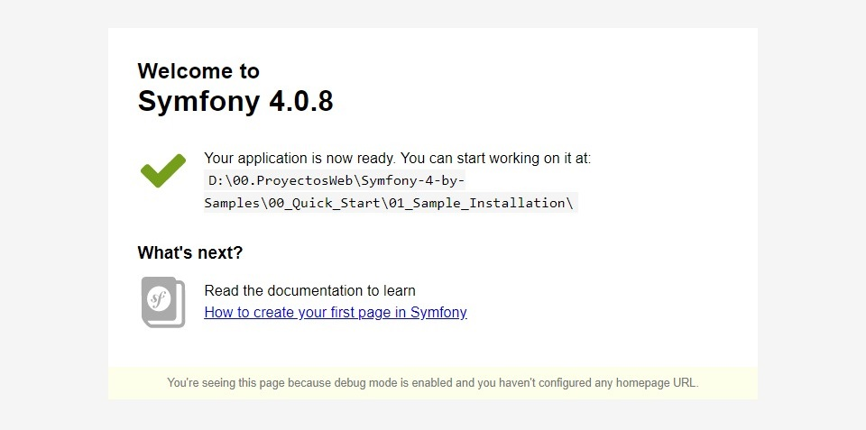

# Purpose of the demonstration - Sample Installation Using Git

We will make our installation from scratch **Project Symfony 4** using **Git**.

## Note

**Git** is a version control software designed by Linus Torvalds, thinking about the efficiency and reliability of maintaining application versions when they have a large number of source files. Its purpose is to keep the record of the files on the computer and coordinate the work that several people perform on shared files.

At first, Git became a low-level engine on which other things, the user interface or front end like Cogito or Stit. However, since then it has become a version control system with full functionality. There are some very important projects that already use Git, in particular, the Linux kernel programming group.

Software maintenance is currently supervised by June Hamano, who receives code contributions from around 280 programmers.

For Windows we will have to download the installer from the web page: [https://github.com/git-for-windows/git/releases/tag/v2.16.1.windows.4](https://github.com/ git-for-windows / git / releases / tag / v2.16.1.windows.4)

You can view yout version of Git in the console writting:

```bash
git status
git add .
```

---------------------------------------------------------------------------------------

* We will create the project through the command of the console: `composer create-project symfony/skeleton 02_Sample_Installation_Using_Git`

---------------------------------------------------------------------------------------

# Summary of Symfony components to use

* [Server Component](https://symfony.com/doc/current/setup.html), `composer require server --dev`
* [Profiler Component](https://symfony.com/doc/current/profiler.html), `composer require --dev profiler`

# First page

1. We will create our project using the command of the console:

```bash
composer create-project symfony/skeleton 02_Sample_Installation_Using_Git
```

2. In the next step, we will access the project folder using:

```bash
cd 02_Sample_Installation_Using_Git
```

3. Then, we will install the **server component** of symfony using of console command:

```bash
composer require server --dev
```

Once we have the account what we have to do is access from the command console to the folder of our project and there we will configure Git with the email with which we have created the Git account.

Then we will create the **first commit**, the **remote repository** and upload all **files** to the main branch.

```bash
git config user.email "tuemail@dominio.com"
git commit -m "Frist Commit"
git remote add Symfony https://github.com/yourAccount/02_Sample_Installation_Using_Git.git
git push Symfony master
```

or by modifying the file [.git/config](.git/config)

_[.git/config](.git/config)_
```diff
[core]
	repositoryformatversion = 0
	filemode = true
	bare = false
	logallrefupdates = true
++[user]
++	email = tuemail@dominio.com
++[remote "Symfony"]
++	url = https://github.com/yourAccount/02_Sample_Installation_Using_Git.git
++	fetch = +refs/heads/*:refs/remotes/Symfony/*
```

Now, we have made some changes in our local repository we will indicate that we want to add all the files to Git using **add**.

The next thing will be to do the **commit** by adding a message explaining what has been done.

Finally we will do a **push** to upload all changes to the main branch.

```bash
git add .
git commit -m "Primer Commit"
git push Symfony-4-Test master
```

4. Now, you must write, to launch the server, in the console the command:

```bash
php bin/console server:run
```

5. Finally, you will have click in next link [http://127.0.0.1:8000](http://127.0.0.1:8000) to view your installation project.

The final result is three React cards that fill the available space on the page.

