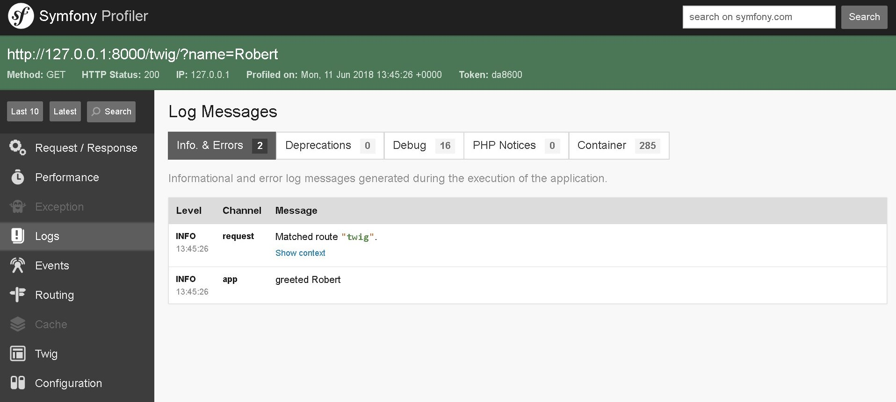

# Purpose of the Demo - 04 Basic Service

We will create a **Basic Service**. 

> Your application is full of useful objects: a "Mailer" object might help you send emails while another object might help you save things to the database. Almost everything that your app "does" is actually done by one of these objects. And each time you install a new bundle, you get access to even more!
In Symfony, these useful objects are called services and each service lives inside a very special object called the service container. The container allows you to centralize the way objects are constructed. It makes your life easier, promotes a strong architecture and is super fast!

# Phases of the Demo
1. [Project Creation](#1project-creation)
2. [Project Creation](#2basic-service)

---------------------------------------------------------------------------------------

* We will create the project through the console command: `composer create-project symfony/skeleton 01_Basic_Service`

---------------------------------------------------------------------------------------

# Summary Symfony component`s to use

* [Server Component](https://symfony.com/doc/current/setup.html), `composer require server --dev`
* [Profiler Component](https://symfony.com/doc/current/profiler.html), `composer require --dev profiler`
* [Twig Component](https://twig.symfony.com/doc/2.x/), `composer require twig`
* [Logging with Monolog](https://symfony.com/doc/current/logging.html), `composer require symfony/monolog-bundle`


# Basic Service

--------------------------------------------------------------------------------------------

## 1.Project Creation

--------------------------------------------------------------------------------------------

1. Created our project using the Console command's, 

```bash
composer create-project symfony/skeleton 01_Basic_Service
```

2. In the next step we will access the project folder using:

```bash
cd 01_Basic_Service
```

3. Execute `composer update` to install the dependencies defined into [composer.json](./composer.json):

```bash
composer update
```

4. It is necessary to install the **server component**, to use our **Server Local**, through the console command:

```bash
composer require server --dev
```

5. Now, you will be able to view the result of demo when write in the terminal the command console:

```bash
php bin/console server:run
```

--------------------------------------------------------------------------------------------

## 2.Basic Service

--------------------------------------------------------------------------------------------

(Source: [https://symfony.com/doc/current/service_container/debug.html](https://symfony.com/doc/current/service_container/debug.html))

> You can find out what services are registered with the container using the console. To show all services (public and private) and their PHP classes, run:

```bash
php bin/console debug:container
```

1. We are going to created the basic controller where to work, [src/Controller/BlogController.php](./src/Controller/BlogController.php).

_[src/Controller/BlogController.php](./src/Controller/BlogController.php)_
```php
<?php

namespace App\Controller;

use Symfony\Bundle\FrameworkBundle\Controller\AbstractController;
use Symfony\Component\HttpFoundation\Request;
use Symfony\Component\HttpFoundation\Response;

class BlogController extends AbstractController
{
  public function response(Request $request)
  {
    $name = $request->get('name');
    return new Response(
      '<html><body>New Name: '.$name.'</body></html>'
    );
  }
}
```

and his routing.

_[config/routes.yaml](./config/routes.yaml)_
```diff
#index:
#    path: /
#    controller: App\Controller\DefaultController::index
++ response:
++  path: /response/
++  controller: App\Controller\BlogController::response
```

2. We will created our first **Service** [src/service/Greeting.php](./src/service/Greeting.php).

_[src/service/Greeting.php](./src/service/Greeting.php)_
```php
<?php

namespace App\Service;

class Greeting
{
  public function greet(string $name): string
  {
    return "Hello $name";
  }
}
```

When we have it we can see the changes in: **[http://127.0.0.1:8000/response/?name=Robert](http://127.0.0.1:8000/response/?name=Robert)**


3. And we will included it in the controller [src/Controller/BlogController.php](./src/Controller/BlogController.php).

> We must add the [Twig Component](https://twig.symfony.com/doc/2.x/), `composer require twig`.

_[src/Controller/BlogController.php](./src/Controller/BlogController.php)_
```diff
<?php

namespace App\Controller;

++ use App\Service\Greeting;

use Symfony\Bundle\FrameworkBundle\Controller\AbstractController;
use Symfony\Component\HttpFoundation\Request;
use Symfony\Component\HttpFoundation\Response;

class BlogController extends AbstractController
{
  public function response(Request $request)
  {
    $name = $request->get('name');
    return new Response(
      '<html><body>New Name: '.$name.'</body></html>'
    );
  }
++ public function twig(Request $request, Greeting $greeting)
++ {
++  $name = $request->get('name');
++  $message = $greeting->greet( $name );
++  return $this->render('base.html.twig', [ 'message' => $message  ] );
++ }    
}
```

we modify the template, [templates/base.html.twig](./templates/base.html.twig), for show the variable.

_[templates/base.html.twig](./templates/base.html.twig)_
```diff
<!DOCTYPE html>
<html>
  <head>
    <meta charset="UTF-8">
      <title>Welcome!</title>
      
    </head>
    <body>
      
++      {{message}}
      
    
  </body>
</html>
```

and we create the route in [config/routes.yaml](./config/routes.yaml).

_[config/routes.yaml](./config/routes.yaml)_
```diff
#index:
#    path: /
#    controller: App\Controller\DefaultController::index
response:
    path: /response/
    controller: App\Controller\BlogController::response
++ twig:
++  path: /twig/
++  controller: App\Controller\BlogController::twig 
```

Now we have it we can see the changes in: **[http://127.0.0.1:8000/twig/?name=Robert](http://127.0.0.1:8000/twig/?name=Robert)**

4. we can improve our code including the libraries inside the class constructor.

_[src/Controller/BlogController.php](./src/Controller/BlogController.php)_
```diff
<?php

namespace App\Controller;

use App\Service\Greeting;

use Symfony\Bundle\FrameworkBundle\Controller\AbstractController;
use Symfony\Component\HttpFoundation\Request;
use Symfony\Component\HttpFoundation\Response;

class BlogController extends AbstractController
{
++ private $greeting;
++ public function __construct(Greeting $greeting)
++ {
++   $this->greeting = $greeting;
++ }
  public function response(Request $request)
  {
    $name = $request->get('name');
    return new Response(
      '<html><body>New Name: '.$name.'</body></html>'
    );
  }
-- public function twig(Request $request, Greeting $greeting)  
++ public function twig(Request $request)
++ {
++  $name = $request->get('name');
--  $message = $greeting->greet( $name );
++  $message = $this->greeting->greet( $name );
++  return $this->render('base.html.twig', [ 'message' => $message  ] );
++ }    
}
```

Now we are going to install the [Logging with Monolog Component](https://symfony.com/doc/current/logging.html), using the command `composer require symfony/monolog-bundle` to modify the log of Symfony.

```bash
composer require symfony/monolog-bundle
```

_[src/service/Gretting.php](./src/service/Gretting.php)_
```diff
<?php

namespace App\Service;

++ use Psr\Log\LoggerInterface;

class Greeting
{
++ private $logger;

++ public function __construct(LoggerInterface $logger)
++ {
++  $this->logger = $logger;
++ }  
  public function greet(string $name): string
  {
++   $this->logger->info("greeted $name");      
    return "Hello $name";
  }
}
```

Finally we have it we can see the changes in: **[http://127.0.0.1:8000/twig/?name=Robert](http://127.0.0.1:8000/twig/?name=Robert)**

> We can access to Toolbar Profile of symfony and inside of Log view the next image.

